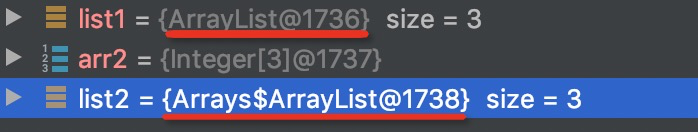

## Arrays.asList把数据转换成List的3个坑

1. 非基础数据类型不会自动装箱
2. Arrays.asList返回的list不支持增、删操作
3. 原始数组的修改会影响到我们获得list



* 通过Arrays.asList()生成的list类型是Arrays$ArrayList（是arrays的内部类）;其调用add、delete方法会报错UnsupportedOperationException；

* 为什么会有这两个对象？意义？

  * java.util.**Arrays**.ArrayList
  * java.util.ArrayList

  答:首先解释为什么Arrays.asList(arr),add会出现UnsupportedOperationException，因为java.util.Arrays.ArrayList没有实现自己的add方法虽然继承了AbstractList但其也没有具体的add实现，直接调用add方法会在AbstractList下抛出UnsupportedOperationException的异常；

  ``` java
  /**
   * @serial include
   */
   private static class ArrayList<E> extends AbstractList<E>
          implements RandomAccess, java.io.Serializable{...}
  
  public abstract class AbstractList<E> extends AbstractCollection<E> implements List<E> {
    ...
      private final E[] a;
     // 直接是对原始数组的引用，所以原始数组的改变会引起我们获得的list发生变化
      ArrayList(E[] array) {
        a = Objects.requireNonNull(array);
      }
  	  public boolean add(E e) {
          add(size(), e);
          return true;
      }
      /**
       * {@inheritDoc}
       *
       * <p>This implementation always throws an
       * {@code UnsupportedOperationException}.
       */
      public void add(int index, E element) {
          throw new UnsupportedOperationException();
      }
    ...
  }
  
  
  ```

  **为什么Arrays里面需要重写一个阉割的静态ArrayList静态类？**

* 解决以上办法的正确使用

  ```java
  String[] arr = {"1", "2", "3"};
  List list = new ArrayList(Arrays.asList(arr));
  arr[1] = "4";
  try {
      list.add("5");
  } catch (Exception ex) {
      ex.printStackTrace();
  }
  log.info("arr:{} list:{}", Arrays.toString(arr), list);
  ```

  

## list.subList的坑点

1. list.subList的返回是原始list的视图----java.util.ArrayList.SubList-可见也是ArrayList的内部类，subList的增、删操作会直接影响原始list；反之亦然；且subList对原始list是一个强引用的关系，即使你后续只使用subList，list的空间也不会释放；

```Java
private class SubList extends AbstractList<E> implements RandomAccess {
        private final AbstractList<E> parent;
        private final int parentOffset;
        private final int offset;
        int size;

        SubList(AbstractList<E> parent,
                int offset, int fromIndex, int toIndex) {
          	// 对arrayslsit的强引用
            this.parent = parent;
            this.parentOffset = fromIndex;
            this.offset = offset + fromIndex;
            this.size = toIndex - fromIndex;
            this.modCount = ArrayList.this.modCount;
        }
  			
  			public E remove(int index) {
            rangeCheck(index);
            checkForComodification();
          	// remove方法实则调用原始list的remove
            E result = parent.remove(parentOffset + index);
            this.modCount = parent.modCount;
            this.size--;
            return result;
        }
```

* 正确使用：

```Java
//方式一：
List<Integer> subList = new ArrayList<>(list.subList(1, 4));

//方式二：
List<Integer> subList = list.stream().skip(1).limit(3).collect(Collectors.toList());
```

## LinkedList在实际使用中真的比ArrayList插入快吗？

* 比ArrayList快的前提是你已经知道待插入位置的前一个节点；上源码

```Java
public void add(int index, E element) {
  // 检查是否会越界
  checkPositionIndex(index);

  if (index == size)
    // 相当于已知插入位置的前面一个节点
    linkLast(element);
  else
    // 插入节点未知的情况，注意这里的node(index)方法
    linkBefore(element, node(index));
}

Node<E> node(int index) {
  // assert isElementIndex(index);
	// 向右位移相当于除二看看index里哪边近一点
  if (index < (size >> 1)) {
    Node<E> x = first;
    // 从左边遍历 答案就在这里了！
    for (int i = 0; i < index; i++)
      x = x.next;
    return x;
  } else {
    Node<E> x = last;
    for (int i = size - 1; i > index; i--)
      x = x.prev;
    return x;
  }
}
```

上述源码已经详细表示出了linkedList并不是想象中那么快的，在不知插入位置的节点还是要先遍历半个list（不用说此操作的时间复杂度是O(n)的）来找到节点，再做插入的。

* 实验证明

```Java
//LinkedList访问
    private static void linkedListGet(int elementCount, int loopCount) {
        List<Integer> list = IntStream.rangeClosed(1, elementCount).boxed().collect(Collectors.toCollection(LinkedList::new));
        IntStream.rangeClosed(1, loopCount).forEach(i -> list.get(ThreadLocalRandom.current().nextInt(elementCount)));
    }

    //ArrayList访问
    private static void arrayListGet(int elementCount, int loopCount) {
        List<Integer> list = IntStream.rangeClosed(1, elementCount).boxed().collect(Collectors.toCollection(ArrayList::new));
        IntStream.rangeClosed(1, loopCount).forEach(i -> list.get(ThreadLocalRandom.current().nextInt(elementCount)));
    }

    //LinkedList插入
    private static void linkedListAdd(int elementCount, int loopCount) {
        List<Integer> list = IntStream.rangeClosed(1, elementCount).boxed().collect(Collectors.toCollection(LinkedList::new));
        IntStream.rangeClosed(1, loopCount).forEach(i -> list.add(ThreadLocalRandom.current().nextInt(elementCount),1));
    }

    //ArrayList插入
    private static void arrayListAdd(int elementCount, int loopCount) {
        List<Integer> list = IntStream.rangeClosed(1, elementCount).boxed().collect(Collectors.toCollection(ArrayList::new));
        IntStream.rangeClosed(1, loopCount).forEach(i -> list.add(ThreadLocalRandom.current().nextInt(elementCount),1));
    }

    @Test
    public void arrayTest() {

        int elementCount = 100000;
        int loopCount = 100000;
        StopWatch stopWatch = new StopWatch();
        stopWatch.start("linkedListGet");
        linkedListGet(elementCount, loopCount);
        stopWatch.stop();
        stopWatch.start("arrayListGet");
        arrayListGet(elementCount, loopCount);
        stopWatch.stop();
        System.out.println(stopWatch.prettyPrint());


        StopWatch stopWatch2 = new StopWatch();
        stopWatch2.start("linkedListAdd");
        linkedListAdd(elementCount, loopCount);
        stopWatch2.stop();
        stopWatch2.start("arrayListAdd");
        arrayListAdd(elementCount, loopCount);
        stopWatch2.stop();
        System.out.println(stopWatch2.prettyPrint());
    }
```

